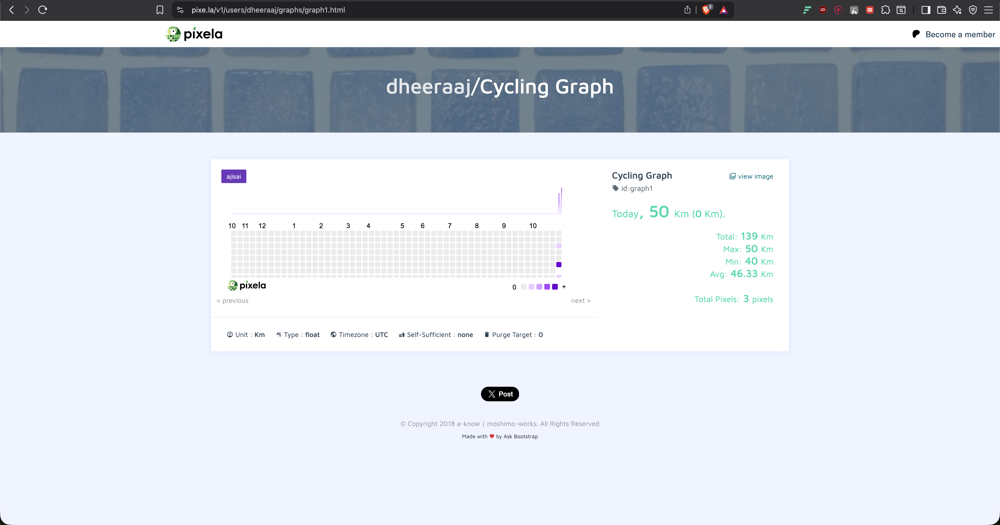

# Habit Tracker with Pixela API

A Python script for tracking habits by interacting with the Pixela API. Pixela is a unique service that allows you to record and visualize data as a pixel-based heatmap, creating a "GitHub contribution graph for your life."

This script provides a command-line interface to create a user, define a habit graph, and then log, update, or delete daily progress for that habit.

## Live Demo

After using the script to log your progress, your habit graph will look like this:



## Viewing Your Habit Graph

Once you've completed the one-time setup (creating your user and graph), you can view your personalized habit graph at any time by navigating to the following URL in your web browser:

`https://pixe.la/v1/users/YOUR_USERNAME/graphs/YOUR_GRAPH_ID.html`

-   Replace `YOUR_USERNAME` with the username you set in the script.
-   Replace `YOUR_GRAPH_ID` with the ID you chose in the `graph_config` (e.g., `graph1`).

## Key Features

-   **Create a Pixela User:** A one-time setup to register your user with the service.
-   **Define a Habit Graph:** Create a new, customizable graph for any habit you want to track.
-   **Log Daily Progress:** Add a "pixel" to your graph to record your progress for a specific day.
-   **Update Past Entries:** Easily correct a mistake by updating the value of a pixel for a past date.
-   **Delete Entries:** Permanently remove a pixel from a specific date.

## Project Setup & Configuration

Follow these steps carefully to personalize and set up your habit tracker.

### 1. Prerequisites

-   Python 3.x
-   `pip` (Python package installer)

### 2. Installation

1.  **Clone the repository:**
    ```bash
    git clone https://github.com/dheerajdhami2001-cyber/habittracker.git
    ```

2.  **Navigate into the project directory:**
    ```bash
    cd habittracker
    ```

3.  **Install the required dependency:**
    ```bash
    pip install requests
    ```

### 3. Configuration: Setting Up Your Tracker

Before running the script, you must configure it with your personal details.

1.  **Open the `habit_tracker.py` file.**
2.  **Set Your Credentials:**
    -   Modify the `USERNAME` variable. Choose a unique username.
    -   Modify the `TOKEN` variable. This is your secret password. Make it complex and at least 8-12 characters long.
3.  **Customize Your Habit Graph:**
    -   Find the `graph_config` dictionary.
    -   Change the `id`, `name`, `unit`, and `color` to match the habit you want to track.

## Running the Script: A Step-by-Step Guide

The script is designed to be run in different phases. You must uncomment certain lines to perform one-time setup actions.

### Part 1: Initial Setup (Run Only Once)

1.  **Create Your User:**
    -   In `habit_tracker.py`, find and **uncomment** the user creation section.
    -   Run the script: `python habit_tracker.py`.
    -   Once successful, **re-comment** that section.

2.  **Create Your Graph:**
    -   Next, find and **uncomment** the graph creation section.
    -   Run the script again: `python habit_tracker.py`.
    -   Once successful, **re-comment** that section.

### Part 2: Daily Logging (Posting a Pixel)

The main, uncommented part of the script is for logging today's activity.
-   Simply run the script: `python habit_tracker.py`.
-   It will prompt you to enter your value for the day, and a new pixel will be added to your graph.

### Part 3: Updating or Deleting an Entry

To modify a past entry, you need to edit the script.

1.  **To Update:**
    -   Find the `pixel_update_endpoint`. Change the date at the end of the URL to the date you want to update (in `YYYYMMDD` format).
    -   **Uncomment** the `requests.put(...)` line below it.
    -   Run the script and enter the new quantity.
    -   **Re-comment** the line when you are done.

2.  **To Delete (Use with caution!):**
    -   Find the `pixel_delete_endpoint`. Change the date to the one you want to remove.
    -   **Uncomment** the `requests.delete(...)` line below it.
    -   Run the script. The pixel for that date will be permanently deleted.
    -   **Re-comment** the line when you are done.

## Acknowledgments

This project was inspired by and completed with the guidance of the **[100 Days of Code: The Complete Python Pro Bootcamp](https://www.udemy.com/course/100-days-of-code/)** by Dr. Angela Yu.
